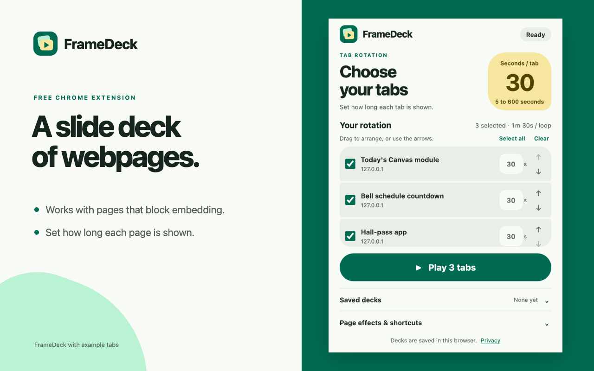

# FrameDeck

FrameDeck is a free Chrome extension that turns webpages into a slide deck by rotating through browser tabs.

I wanted a slide deck of the pages I use while teaching: today's Canvas module, the bell schedule countdown, the hall-pass app. Many websites block iframe embedding. FrameDeck uses browser tabs as the slides, which solved the issue for me.



## Try it locally

Requires Chrome 120 or newer.

1. Open `chrome://extensions` in Chrome.
2. Turn on **Developer mode**, choose **Load unpacked**, and select this repository's `extension` folder.
3. Open the websites you want to show in one window, then open FrameDeck's side panel from Chrome's toolbar. The controls stay open as tabs rotate.
4. Select and arrange the tabs, set the default duration, and start your deck.

Use the per-tab duration to give an announcement more time. Pause, resume, or step between tabs from the side panel. Close the panel when you want more room for the page; rotation continues. Use Chrome's fullscreen command if you want to hide browser controls; FrameDeck does not enter fullscreen automatically.

## Saved decks

A saved deck keeps the selected tabs, their order, durations, and display settings on this device. Loading it reuses matching tabs in the current window and opens missing ones. It preserves repeated URLs as separate entries. Loading a deck does not start rotation automatically.

## Controls and access

- Arrange tabs by dragging or with the move buttons.
- Suggested shortcuts: `Alt+Shift+P` pauses/resumes an active deck; `Alt+Shift+Left` and `Alt+Shift+Right` step between tabs. Change keyboard commands at `chrome://extensions/shortcuts`; your operating system or another extension may reserve a suggested shortcut.
- Page countdowns and transitions need optional website access. Tab rotation works without those page effects. Chrome blocks effects on protected pages such as browser settings and the Chrome Web Store.
- Only one deck rotates at a time. Closing a selected tab removes it from the rotation. Restarting Chrome ends the rotation; saved decks remain available.
- Timing is best effort. Computer sleep, browser resource limits, or an interrupted extension process may delay a switch. FrameDeck is not a precision timer or a managed kiosk.

## Privacy

Tab titles, URLs, saved decks, and preferences stay in this Chrome profile. FrameDeck has no account, analytics, advertisements, or server. It does not read page text or form entries. Restored websites still make their normal network requests. Read the [privacy policy](docs/PRIVACY.md).

For troubleshooting and reporting a problem, see [FrameDeck help](docs/SUPPORT.md). Release changes are in [CHANGELOG.md](CHANGELOG.md).

## Development and packaging

There is no build step or runtime framework. Edit the files in `extension`, reload the extension in Chrome, and reopen its side panel to see changes.

```sh
node --test tests/*.test.cjs
python3 scripts/package.py
```

The script checks the manifest and icon dimensions, writes a ZIP with `manifest.json` at its root, and verifies the packaged bytes. It also stages the upload files and documentation in `dist/FrameDeck-1.1.0-submission/`, with a checksum inventory and a `START-HERE.md` guide. Sorted entries and fixed timestamps make repeated builds of unchanged files reproducible in the same Python environment. The ZIP excludes tests, documentation, store art, and repository metadata.

Chrome's event-driven background worker manages rotation with a persisted deadline, a native alarm, and short in-memory timers. Current rotation lives in session storage; saved decks and preferences live in local storage. The side panel controls the worker, and optional scripts draw the countdown and transition on permitted pages. No offscreen timer or remote code is used.

See [the validation record](docs/QA.md) for observed browser results and repeatable checks. See [the release checklist](docs/RELEASE.md) for browser checks and submission steps, and [store listing copy](docs/STORE_LISTING.md) for review-ready text. A built ZIP is a release candidate; Chrome Web Store approval and publication are separate steps.

## License

[MIT](LICENSE)
